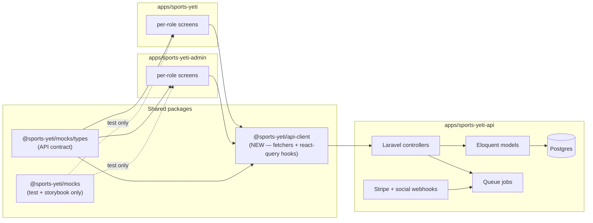

# Sports Yeti — Backend Wiring Plan

> Companion to [marketplace-brief.md](./marketplace-brief.md). The marketplace UX shipped against `@sports-yeti/mocks` types — this plan replaces the fixtures with real APIs without changing screens (the type contract is the API contract).

## Goals

1. **Zero screen rewrites.** Every screen depends on `@sports-yeti/mocks` types — swap fixture arrays for fetchers that return the same shape.
2. **Schema parity with the UX entities.** Where the marketplace introduced new entities (`Organization`, `Season`, `Division`, `FacilityOwnership`, `SpaceRentalConfig`, `RoleStack`, `SocialPostDraft`, augmented `Waiver` scopes), add migrations + models + controllers in lockstep.
3. **Hard enforcement of the gates the UI describes.** Waivers, division registration windows, max-team caps, payment thresholds, FM rental approval — all must be enforced server-side, not just visually.
4. **Backwards compatibility for existing screens** during migration. Both the legacy League/Facility shape and the new marketplace shape ship side-by-side until every consumer migrates.

## Locked decisions (carry from the marketplace brief)

1. Org → League → Season → Division hierarchy
2. Org-owned facilities; spaces with `rentalMode: internal | external | both`
3. Stackable roles (single user can hold many)
4. Sport-agnostic — sport drives stat templates, not feature gates
5. Referee mobile module rebuilt — needs payouts + assignment lifecycle
6. News/promotions cross-post to X / FB / IG / LinkedIn (real OAuth)
7. Waiver gates enforced at: team approval, game eligibility, facility check-in, paid game join, referee bid, external rental approval

## Defaults to flag for review (please confirm before Phase A0)

- **Multi-tenancy axis**: change from `league_id`-scoped (current) to `organization_id`-scoped. Every entity gets `organization_id` instead of (or alongside) `league_id`. Tenant guard middleware filters by active org from the JWT.
- **Stackable roles**: model as a join table `role_assignments(user_id, role, scope_type, scope_id)` rather than mutually-exclusive Spatie roles. Spatie Permission still drives the permission set; role assignment becomes the lookup key.
- **Stripe Connect topology**: each Organization is a Stripe Connected Account (Express). Players + renters pay the platform; payouts go to the Org's connected account net of platform fees. Referee + FM payouts route through the same connected account as splits.
- **Push provider**: keep Expo for the mobile app, add web push for admin notifications later.

---

## Package architecture (target)



The plan introduces **`@sports-yeti/api-client`** as the real-data sibling of `@sports-yeti/mocks`. Both packages re-export the same types from a future `@sports-yeti/types` so screens import from one place. Phase A0 carves the types out; Phase A1 stands up the client.

---

## Phase A0 — Foundations (1 sprint)

Goal: type sharing + tenant model + role model decisions.

- **A0.1** Carve types out of `@sports-yeti/mocks/src/types.ts` into a new `@sports-yeti/types` package. Both `@sports-yeti/mocks` and the new `@sports-yeti/api-client` depend on `@sports-yeti/types`. Screens keep importing types from `@sports-yeti/mocks` (re-exported) — no screen edits.
- **A0.2** Decide and document the multi-tenancy axis (org vs league). Recommendation: `organization_id` becomes the tenant key, with `league_id` carrying the competition scope inside.
- **A0.3** Decide stackable-roles storage. Recommendation: `role_assignments(user_id, role, scope_type, scope_id, scope_label)` with a Spatie permission set per role.
- **A0.4** New `@sports-yeti/api-client` Nx package: thin axios wrapper, react-query hook generators per resource (`useOrganization`, `useDivisions`, `useApplyTeamToDivision`, etc.). Depends on `@sports-yeti/types`. Pre-instrumented with Sentry breadcrumbs + auth header from the mobile + admin auth stores.
- **A0.5** Mock-swap policy doc (`mocks/MockSwap.md`): per-screen recipe — replace `import { LEAGUES } from '@sports-yeti/mocks'` with `import { useLeagues } from '@sports-yeti/api-client'`. Keeps the swap mechanical.
- **A0.6** Feature-flag system: `useFeatureFlag('marketplace_org_hierarchy')` lets us flip between the legacy League-scoped backend and the new marketplace surface per-tenant during rollout.

Acceptance: `@sports-yeti/types` + `@sports-yeti/api-client` build clean. A reference screen (e.g. `OrganizationListScreen`) compiles against either `@sports-yeti/mocks` or `@sports-yeti/api-client` by changing one import. Decisions doc reviewed by `@backend-architect` + `@security-engineer`.

---

## Phase A1 — Org / Season / Division / Role schema (1 sprint)

Goal: the new entity schema lands as additive migrations alongside the existing league-scoped tables.

### Migrations

| Table | Purpose |
|---|---|
| `organizations` | Tenant root: `id` (UUID), `name`, `slug`, `logo_url`, `city`, `state`, `country`, `brand_color`, `brand_color_accent`, `owner_user_id`, `social_links` (JSONB), `social_integration_status` (JSONB), `created_at`, `updated_at`, `deleted_at` |
| `seasons` | `id`, `organization_id`, `league_id`, `label`, `cycle` ENUM, `year`, `start_iso`, `end_iso`, `status` ENUM, `weekly_slot_label`, `format` ENUM, `regular_weeks`, `playoff_weeks` |
| `divisions` | `id`, `organization_id`, `league_id`, `season_id`, `name`, `skill_level` ENUM, `age_band`, `max_teams`, `registered_teams_cached`, `registration_fee_cents`, `registration_opens_iso`, `registration_closes_iso`, `status` ENUM, `roster_min`, `roster_max` |
| `role_assignments` | `id`, `user_id`, `role` ENUM, `scope_type` ENUM, `scope_id` UUID nullable, `scope_label`, `is_primary`, `activated_at` |
| `facility_ownerships` | `id`, `facility_id`, `owner_org_id`, `manager_user_ids` (jsonb array of UUIDs) |
| `space_rental_configs` | `id`, `space_id`, `rental_mode` ENUM, `external_hourly_rate_cents`, `internal_league_ids` (jsonb), `blackout_dates` (jsonb) |
| `recurring_availability_slots` | `id`, `space_id`, `weekday` ENUM, `start_time`, `end_time`, `effective_from_iso`, `effective_to_iso`, `hourly_rate_cents`, `is_peak` |

### Migrations on existing tables

- `leagues` adds `organization_id` (nullable for backward compat), `slug`, `sport_tagline`, `active_season_id` FK.
- `teams` adds `organization_id`, `division_id`, `roster_min`, `roster_max`, `per_player_override_cents`. Existing `league_id` becomes derived.
- `facilities` adds `owner_org_id`. The current `league_id` becomes nullable + deprecated; a backfill job copies `league_id → owner_org_id` based on the league's owner org.
- `spaces` keeps existing fields; rental mode + recurring availability live in the new tables (above).
- `players` adds `lat`, `lng`, `availability_flags` (jsonb array — `looking_for_team` + `available_to_sub` independently), `privacy` ENUM (replaces `is_private`).
- `referees` adds `lat`, `lng`. The existing `radius_miles` + `availability` JSONB are honored.
- `games` adds `kind` ENUM (`league` | `open_play`), `per_player_fee_cents`, `referee_market_status` ENUM.
- `waivers` adds `scope_kind` ENUM (org / league / division / facility) + nullable `scope_id`. Existing rows backfill as `scope_kind=organization, scope_id=org_id`.
- `news_articles` adds `organization_id`, `audience` ENUM, `tags` (jsonb), plus a new `social_post_drafts` table (id, news_id, channels jsonb, status, scheduled_iso, copy_by_channel jsonb, image_url, posted_at, failure_reason).

### Tenant guard

- New `OrgScope` global scope on every org-scoped model (mirrors current `TenantScope` but keyed by `organization_id`).
- JWT token gains a `current_org_id` claim. Middleware sets `App\Context::setActiveOrg(...)` from the claim.
- The Spatie permission registrar reads `role_assignments` to compute the user's roles for the active org.

### Seeders

- Replace the current `RolesAndPermissionsSeeder` with `MarketplaceRolesSeeder` mapping the 6 stackable roles → permission sets that mirror the FE `RoleStack` shape.
- A `DemoOrgSeeder` mirrors the `@sports-yeti/mocks` demo org (`Yeti Collective`, demo user `alex@yeti.test`, two leagues, two seasons each, divisions, facilities, etc.) so the admin app demo against staging matches the mock demo.

Acceptance: `php artisan migrate:fresh --seed` produces a database that matches the mocks 1:1. A new feature test `tests/Feature/MarketplaceSeederTest.php` walks the org tree and asserts counts.

---

## Phase A2 — Org / Season / Division API + Approvals (1 sprint)

Goal: replace the placeholder admin screens with live data.

### Controllers (new)

- `OrganizationController` — `index`, `show`, `update` (brand color triggers cache invalidation), `members` (list role assignments).
- `SeasonController` — `index?league_id=`, `show`, `store`, `update`, `destroy` (only when no divisions reference).
- `DivisionController` — `index?season_id=`, `show`, `store`, `update`, `destroy`. The `store`/`update` paths enforce: registration window inside season window; max_teams ≥ 1; fee in cents.
- `ApprovalsController` — `index?type=teams|rentals` (paginated cursor); `bulkApprove(ids[])`; `bulkReject(ids[], reason)`. Triggers notifications (push + email) to applicants.
- `RoleAssignmentController` — `index?user_id=`, `store` (activate role for self), `destroy` (deactivate). Org Admin can grant other roles via `Admin/RoleAssignmentController`.

### Refactored controllers

- `LeagueController` returns the new shape with `organization_id`, `active_season_id`, no `seasonName`/`feeCents`/`maxTeams` (those moved to season + division). Backwards-compat: include the legacy fields when `?legacy_shape=1`.
- `TeamController.applyToDivision(team_id, division_id)` — new endpoint. Validates registration window, max_teams cap, captain owns the team, captain has signed required waivers, all roster members have signed required waivers (or returns the blocking list to the FE for the WaiverGate). Sets team status to `pending_review` and creates the audit entry.
- `TeamController.updateStatus` adds the gate check (waivers signed for all roster members) before allowing `approved`.

### Acceptance per UI flow

| Mobile/Admin flow | Endpoint(s) | Gates enforced |
|---|---|---|
| Admin creates Season | `POST /seasons` | Org Admin role; date sanity |
| Admin creates Division | `POST /divisions` | Reg window inside season; max_teams ≥ 1 |
| Captain applies team | `POST /teams/{id}/apply-to-division` | Open registration; cap not full; waiver gate |
| Admin approves team | `PATCH /teams/{id}/status approved` | Waivers signed by every roster member |
| Approvals inbox | `GET /approvals?type=teams` | Org Admin or League Admin |

---

## Phase A3 — Facility ownership + recurring availability + dual rental (1 sprint)

Goal: the dual-rental model the UX describes, enforced server-side.

### Endpoints

- `FacilityOwnershipController` — `index`, `update(facility_id, owner_org_id, manager_user_ids[])`. Org Admin only.
- `SpaceRentalController` — `update(space_id, rental_mode, external_hourly_rate_cents, internal_league_ids[], blackout_dates[])`. FM or Org Admin.
- `RecurringAvailabilityController` — `index?space_id=`, `bulkUpsert(space_id, slots[])` for the editor. Validates: no overlap within same weekday + season window; price ≥ 0.
- `BookingController` gains:
  - `POST /bookings/external-request` — public endpoint (rate-limited) for external renters; creates `requested` booking. Triggers FM notification.
  - `POST /bookings/{id}/approve` — FM only. Locks slot atomically; double-booking check inside `BookingService::approve` with row-level locking on the time window. Triggers renter notification.
  - `POST /bookings/{id}/reject` — FM only. Notifies renter with reason.

### Conflict + utilization

- `BookingService::hasConflict(space_id, start, end)` extended to consult `recurring_availability_slots` first (slot must exist and not be in `blackout_dates`), then existing bookings.
- `AnalyticsController::facilityUtilization` rewritten to compute `booked_hours / available_hours` (sum of recurring slots minus blackouts) per space per week. Replaces the broken "completion-rate" formula. Heatmap data: per `(weekday, hour-of-day)` bucket count of confirmed bookings ÷ slot capacity.

### Acceptance

- A space toggled to `external` exposes a public listing endpoint `GET /facilities/{id}/external-listing` returning the renter-facing data (name, photos, rate, available slots).
- An external rental request races a league game on the same slot — last-write-loses with a 409 + audit entry.
- FM analytics returns true-utilization that matches a hand-checked spot value.

---

## Phase A4 — Stripe Connect + payments topology (1 sprint)

Goal: every money flow the UX describes hits Stripe correctly.

### Connect onboarding

- `StripeConnectController` — `POST /organizations/{id}/stripe-connect/start` (returns Express onboarding URL), `POST .../refresh` (refresh link), webhook `account.updated` flips `organizations.stripe_connect_status`.
- `OrgIntegrationsScreen` (admin) wires the "Connect Stripe" button to this flow.

### Payment intents (per money flow)

| Flow | Intent type | Application fee | Payout target |
|---|---|---|---|
| Team registration (per-player share) | `payment_intent` with `transfer_data[destination]=org_account` | 5% platform | Org |
| Open-play game join (paid) | Same shape | 5% platform | Org |
| External space rental | Same shape | 8% platform | Org (FM revenue split via Org payout schedule) |
| Referee payout | `transfer` from Org account → Referee bank (Connect Express) | 0% (Org pays) | Referee |
| Refund | `refund` against original `payment_intent_id` | Pro-rated | Returned |

### Endpoints

- `POST /payments/intent/team-share/{team_member_id}` — replaces existing per-player intent path; uses real Connect transfer_data.
- `POST /payments/intent/open-game/{game_id}` — new; required when game has `per_player_fee_cents > 0`.
- `POST /payments/intent/external-rental/{booking_id}` — new; charged when external renter accepts FM-approved booking.
- `POST /payouts/referee/{assignment_id}` — invoked by `ReleaseRefereePayoutJob` 24h after report submission (gives Org admin time to dispute).

### Webhook handler

- Existing `WebhookController::handleStripe` extended to handle `transfer.created`, `payout.paid`, `account.updated`, `application_fee.created`. Each updates the corresponding row + emits a notification.

### Reconciliation

- `ReconcilePaymentsJob` already exists. Extend it to reconcile the new payment types, plus a new `ReconcileTransfersJob` for referee payouts.

### Acceptance

- A team's `payment_summary.is_complete=true` triggers `dispatch(NotifyCaptainTeamFundedJob)`.
- An accepted external rental → 60 seconds later → captured payment, 5% application fee logged, audit entry created.
- A referee `submitReport` → 24h cron → `ReleaseRefereePayoutJob` runs → transfer to ref's Connect account → push notification fires.

---

## Phase A5 — Waiver enforcement everywhere (½ sprint)

Goal: the WaiverGate the UX displays gets a server-side equivalent at every gate.

### Domain services

- New `App\Domain\WaiverGate::evaluate(user, scopes[])` returns `{required, signed, blocking}` — the same shape as the FE `computeWaiverGate`.
- Used by:
  - `TeamApprovalPolicy::approve(team)` — fails approval if any roster member has blocking waivers.
  - `GameEligibilityPolicy::join(game, player)` — fails join if player has blocking waivers for `[org, facility]`.
  - `BookingPolicy::checkIn(booking)` — fails check-in if player has blocking waivers (the existing `// TODO` in `BookingController::checkIn`).
  - `RefereeAssignmentPolicy::accept(assignment, referee)` — fails if referee waiver unsigned.
  - `BookingPolicy::approveExternal(booking)` — warns FM if renter contact has unsigned facility-use waiver (warning, not block — FM judgment).

### Endpoint

- `GET /me/waivers/gate?scope_kind=&scope_id=` — returns the gate state. The FE `useWaiverGate` swaps from local computation to this fetcher.

### Sign-flow improvements

- `WaiverController::sign` updates `team_members.waivers_signed=true` for every team the user is on whose required waivers are now satisfied. (Today the flag is permanently false — this fixes that.)

### Acceptance

- Every gated CTA in the marketplace UX has a corresponding server gate.
- A player signs a waiver → the team's `payment_summary.is_complete` is recomputed automatically.

---

## Phase A6 — Notifications matrix (½ sprint)

Goal: the right person hears about the right event on the right channel.

### Channel matrix (per event)

| Event | Push | Email | In-app | SMS |
|---|---|---|---|---|
| Team application status change | ✓ | ✓ | ✓ | — |
| Schedule published | ✓ all rostered players | ✓ captains | ✓ | — |
| Game day reminder (T-24h, T-1h) | ✓ | — | ✓ | opt-in |
| Sub request applicant | ✓ captain | — | ✓ | — |
| Sub request filled | ✓ player | ✓ | ✓ | — |
| External rental status | — | ✓ renter | ✓ FM | — |
| Referee assignment offered | ✓ | ✓ | ✓ | — |
| Referee bid selected | ✓ | ✓ | ✓ | — |
| Referee report due | ✓ | — | ✓ | — |
| Payout settled | ✓ | ✓ | ✓ | — |
| News published | ✓ subscribed roles | ✓ digest opt-in | ✓ | — |
| Waiver expiring (T-30d) | ✓ | ✓ | ✓ | — |

### Implementation

- `NotificationService::sendEmailNotification` — replace the `Log::info` stub with Laravel Mail templates per event type. Markdown mailables.
- New `SendGameRemindersJob` cron: every hour, find games at T-24h and T-1h, dispatch reminders.
- New `SendWaiverExpirationJob` cron: daily, find signatures expiring in 30 days, notify.
- `NotificationPreferenceController` — `GET/PUT /me/notification-preferences` per channel + per event type. Mobile `SettingsScreen` wires this.

### Acceptance

- Every event in the matrix has a test in `tests/Feature/Notifications/` that asserts which channels fire for which user roles.
- Email digest opt-out honored.

---

## Phase A7 — Referee marketplace lifecycle (½ sprint)

Goal: complete the referee marketplace the UX exposes.

### Endpoints

- `POST /games/{id}/open-to-bid` — Admin or Captain sets `games.referee_market_status='open_to_bid'`, optional `referee_base_rate_cents`. Fan-out push to referees within radius (already in mocks — needs a `RefereeMatchingService`).
- `POST /referees/games/{game_id}/bid` — extended: includes message; respects radius + availability check server-side.
- `POST /referees/assignments/{id}/select-bid` — Admin or Captain selects winning bid; rejects others; locks referee_market_status='assigned'.
- `POST /referees/assignments/{id}/decline` — already exists; extended to include reason.
- `RefereeMatchingService::nearbyReferees(game, radius_miles)` — uses PostGIS (`ST_Distance`) on the new `referees.lat`/`lng`. Same query powers the marketplace query.

### Acceptance

- Captain opens game to bid → 3 referees get push notifications within 5s.
- Captain selects a bid → losing bids auto-rejected → winning ref gets push.

---

## Phase A8 — News + social cross-post (½ sprint)

Goal: make the cross-post composer real.

### OAuth integrations (Org Admin)

- `IntegrationsController::startOAuth(org_id, channel)` — returns redirect URL for Twitter/X, Facebook (Meta Business), Instagram (via Meta Graph), LinkedIn.
- Per-channel OAuth callback handlers persist the access tokens in `organization_social_credentials` (separate table to keep secrets out of the org row).

### Posting

- `POST /news/{id}/social-post-drafts` — creates the draft (already in mocks).
- `POST /social-post-drafts/{id}/publish` — publishes to the channels via per-channel adapter classes. Returns posted status + URL.
- `POST /social-post-drafts/{id}/schedule` — sets `scheduled_iso`; `PostSocialDraftsJob` cron picks them up.
- Each channel adapter (e.g. `XAdapter::publish(text, image_url, credentials)`) handles the actual API call. Failures retry with exponential backoff and update `failure_reason`.

### Acceptance

- Composer "Post Now" → posts to all selected channels → preview cards show "Posted ✓" with each channel's URL.
- Schedule → cron job posts at the scheduled time → audit log captures success/failure per channel.

---

## Phase A9 — Geo + discovery (½ sprint)

Goal: real distance filters on Discover, marketplace, and player directory.

- `players` + `referees` + `facilities` get PostGIS columns (`location geometry(Point, 4326)`). Backfill from existing `lat`/`lng`.
- `GET /games?within_miles=X&from_lat=&from_lng=` and same on `/players`, `/referees`, `/facilities`. Powered by `ST_DWithin`.
- Mobile `DiscoverScreen`, `PlayerDirectoryScreen`, and `RefereeHomeScreen` marketplace tab swap their distance-mock inputs for the geo filter.

---

## Phase A10 — Push (Expo) + sched job runners (½ sprint)

- Expo push: `NotificationService::sendPushNotification` already implemented. Wire device-token lifecycle: `PUT /me/push-token` already exists; ensure rotation on app launch + clear on logout.
- Cron / queue: `php artisan schedule:run` registers `SendGameRemindersJob`, `SendWaiverExpirationJob`, `ReleaseRefereePayoutJob`, `ReconcilePaymentsJob`, `ReconcileTransfersJob`, `PostSocialDraftsJob`. All run on Horizon.

---

## Phase A11 — Mock-to-API swap (1 sprint)

Goal: replace fixture imports with `@sports-yeti/api-client` hooks across every screen, behind a feature flag.

### Per-screen swap recipe

```ts
// Before (fixtures)
import { LEAGUES, leagueById } from '@sports-yeti/mocks';
const league = leagueById(id);

// After (api-client)
import { useLeague } from '@sports-yeti/api-client';
const { data: league, isLoading, error } = useLeague(id);
```

The hook signature returns the same shape — the UI rendering doesn't change.

### Phased rollout (per surface, behind flag)

1. Org Admin surfaces (Pulse, Money, People, Branding, Integrations)
2. League Admin surfaces (League/Season/Division CRUD, Approvals)
3. FM surfaces (Dashboard, Calendar, Spaces, Availability, Analytics)
4. Captain surfaces (Home, TeamCreate, DivisionApply, Sub flows)
5. Player surfaces (Discover, Profile, JoinGame, Waivers)
6. Referee surfaces (Inbox, Marketplace, Reports, Earnings)
7. Mobile NewsFeed
8. Admin News composer + cross-post

Each step lights up the `?api=true` flag for a target screen, validates against staging, then defaults to true.

### Acceptance

- Every screen renders against the live API in staging.
- `@sports-yeti/mocks` becomes test-only (Storybook + Playwright fixtures).

---

## Phase A12 — Hardening + cutover (1 sprint)

- **Performance**: query plan review on the ten heaviest endpoints (org tree fetch, FM analytics, marketplace bids); add indexes (`(season_id, status)` on divisions, `(facility_id, weekday, start_time)` on availability slots, GIST indexes on geo columns).
- **Security audit** (`@security-engineer`): per-role permission set sweep; rate limits on public endpoints (external rental request, OAuth callbacks); secrets rotation for social tokens; OWASP ASVS L2 re-pass against the new surface.
- **Load tests**: extend the existing k6 scripts in `tests/load/` to cover Approvals, External rental approve, Org Pulse, FM Analytics, Marketplace bid.
- **Rollback path**: every migration has a tested `down()`; feature flags can flip back to mock mode per screen.
- **Cutover demo**: same 12-minute walk-through of the demo user, but against staging — all 6 roles, all the gates fire for real.

Acceptance: SLOs hold (see `docs/slo-definitions.md`). Pilot org `Yeti Collective` is migrated end-to-end and smoke-tested.

---

## Sequencing summary

```
Sprint 1: Phase A0   (foundations: types package, api-client, decisions)
Sprint 2: Phase A1   (Org/Season/Division/Role schema + tenant guard)
Sprint 3: Phase A2   (Org/Season/Division API + Approvals)
Sprint 4: Phase A3   (Facility ownership + dual rental + utilization)
Sprint 5: Phase A4   (Stripe Connect + payments topology)
Sprint 6: Phase A5 + Phase A6   (Waiver enforcement + Notifications matrix)
Sprint 7: Phase A7 + Phase A8   (Referee marketplace + News cross-post OAuth)
Sprint 8: Phase A9 + Phase A10  (Geo + Push + scheduled jobs)
Sprint 9: Phase A11  (Mock-to-API swap, screen by screen)
Sprint 10: Phase A12 (Hardening + cutover demo)
```

10 sprints. Phases A5+A6, A7+A8, A9+A10 parallelize across two engineers.

## Out of scope (this plan)

- Tournaments, equipment rental, point gamification — still post-MVP per `scope.md`.
- AI highlight generation — existing `HighlightController` + `GenerateHighlightsJob` stay as-is.
- Mobile-app deep ops UI for OrgAdmin/LeagueAdmin — stays the lightweight shells from the marketplace UX.

## Risks & mitigations

- **Tenant axis change is a load-bearing migration** → add `organization_id` columns nullable first, backfill in a separate migration, then enforce non-null after every consumer is migrated. Reversible at every step.
- **Stripe Connect onboarding friction for orgs** → ship the OAuth flow with a "Save for later" so an Org Admin can finish onboarding the day they need to take their first payment, not at signup.
- **Social OAuth tokens churn (especially X)** → background `RefreshSocialTokensJob` daily; UI surfaces "Reconnect" when status flips to `expired`.
- **PostGIS adds an extension dependency** → guarded behind a feature flag during rollout; fall back to bounding-box filters if PostGIS unavailable.
- **Notification fatigue** → enforce per-event opt-out from day one; ship a digest mode for non-urgent events.
- **Referee payout disputes** → 24h delay on `ReleaseRefereePayoutJob` gives Org Admin time to dispute; admin UI gets a "Hold payout" button on the assignment row.

## Decisions to confirm (please flag if any are wrong)

1. **Tenant axis** = Organization (not League). Add `organization_id` everywhere; `league_id` becomes a child key.
2. **Roles model** = stackable via `role_assignments` join table; Spatie Permission still drives the permission set per role.
3. **Stripe Connect** = each Organization is an Express connected account; platform fees are 5% on registration/open-play, 8% on external rentals.
4. **Geo** = PostGIS for distance filters; backfilled from existing nullable `lat`/`lng`.
5. **Type sharing** = new `@sports-yeti/types` package carved out of `@sports-yeti/mocks/src/types.ts`; both `mocks` and `api-client` re-export.
6. **Feature-flag system** = per-screen `?api=` flag during the swap phase, then global default.
