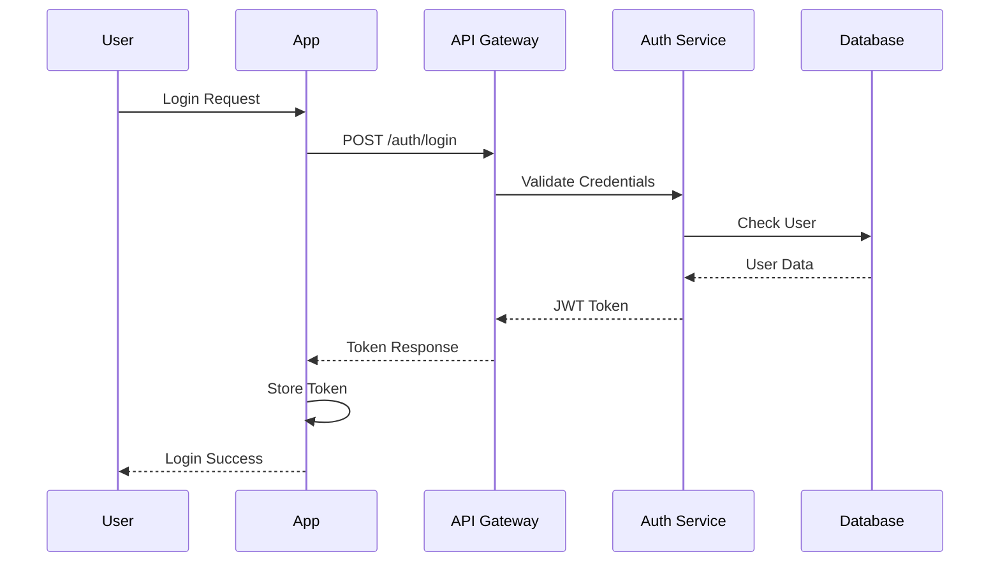

# 🏀 Sports Yeti - Technical Design Specification
## Spec-Driven Development Architecture

---

## 📋 Design Philosophy

This document follows **spec-driven development** principles, providing detailed technical specifications before implementation. Each component is designed with clear interfaces, data contracts, and integration points to ensure consistent development and testing.

**Design Principles:**
- **API-First**: All features designed as APIs first, then UI
- **Contract-Driven**: Clear data contracts and interface specifications
- **Testable**: Every component designed for comprehensive testing
- **Scalable**: Architecture supports growth from MVP to full platform
- **Modular**: Independent components with clear boundaries

---

## 🏗️ System Architecture

### **High-Level Architecture**

```
┌─────────────────┐    ┌─────────────────┐    ┌─────────────────┐
│   Mobile App    │    │   Web App       │    │   Admin Panel   │
│  (React Native) │    │(React Native Web)│   │(React Native Web)│
└─────────────────┘    └─────────────────┘    └─────────────────┘
         │                       │                       │
         └───────────────────────┼───────────────────────┘
                                 │
                    ┌─────────────────┐
                    │   API Gateway   │
                    │   (Laravel)     │
                    └─────────────────┘
                                 │
         ┌───────────────────────┼───────────────────────┐
         │                       │                       │
┌─────────────────┐    ┌─────────────────┐    ┌─────────────────┐
│   PostgreSQL    │    │   Redis Cache   │    │   File Storage  │
│   (Primary DB)  │    │   (Sessions)    │    │   (AWS S3)      │
└─────────────────┘    └─────────────────┘    └─────────────────┘
```

### **Technology Stack**

#### **Backend**
- **Framework**: Laravel 11 (PHP 8.2+)
- **Database**: PostgreSQL 15+
- **Cache**: Redis 7+
- **Queue**: Laravel Horizon with Redis
- **File Storage**: AWS S3
- **Search**: Elasticsearch (future)
- **Monitoring**: Sentry, Laravel Telescope
- **AI Integration**: OpenAI API, MCP (Model Context Protocol) compatibility

#### **Frontend**
- **Web App**: React Native Web (React 19)
- **Mobile App**: React Native with Expo
- **State Management**: Zustand (unified across platforms)
- **UI Framework**: React Native Paper + NativeBase
- **Real-time**: Socket.io client
- **AI Chat**: OpenAI GPT-4 integration

#### **Infrastructure**
- **Hosting**: AWS ECS or DigitalOcean App Platform
- **CDN**: Cloudflare
- **Email**: Resend or AWS SES
- **SMS**: Twilio
- **Payment**: Stripe
- **Push Notifications**: Expo Notifications

---

## 🔌 API Design Specification

### **API Structure**

```
/api/v1/
├── auth/
│   ├── login
│   ├── register
│   ├── logout
│   └── refresh
├── users/
│   ├── profile
│   ├── settings
│   └── preferences
├── leagues/
│   ├── {id}
│   ├── {id}/teams
│   ├── {id}/players
│   └── {id}/games
├── teams/
│   ├── {id}
│   ├── {id}/members
│   └── {id}/games
├── facilities/
│   ├── {id}
│   ├── {id}/spaces
│   └── {id}/bookings
├── games/
│   ├── {id}
│   ├── {id}/participants
│   └── {id}/chat
├── camps/
│   ├── {id}
│   ├── {id}/sessions
│   └── {id}/registrations
├── payments/
│   ├── create
│   ├── {id}/confirm
│   └── {id}/refund
├── notifications/
│   ├── list
│   └── mark-read
├── ai/
│   ├── chat
│   ├── chat/history
│   └── chat/stream
└── mcp/
    ├── tools
    ├── resources
    └── capabilities
```

### **Authentication & Authorization**

#### **JWT Token Structure**
```json
{
  "header": {
    "alg": "HS256",
    "typ": "JWT"
  },
  "payload": {
    "sub": "user_id",
    "iss": "sports-yeti",
    "iat": 1640995200,
    "exp": 1641081600,
    "roles": ["player", "captain"],
    "permissions": ["create_team", "book_facility"]
  }
}
```

#### **Role-Based Access Control**
```php
// User Roles
enum UserRole: string {
    case PLAYER = 'player';
    case CAPTAIN = 'captain';
    case LEAGUE_ADMIN = 'league_admin';
    case REFEREE = 'referee';
    case TRAINER = 'trainer';
    case SYSTEM_ADMIN = 'system_admin';
}

// Permissions
enum Permission: string {
    case CREATE_TEAM = 'create_team';
    case JOIN_TEAM = 'join_team';
    case BOOK_FACILITY = 'book_facility';
    case CREATE_GAME = 'create_game';
    case MANAGE_LEAGUE = 'manage_league';
    case MANAGE_CAMPS = 'manage_camps';
    case VIEW_ANALYTICS = 'view_analytics';
}
```

### **Data Models Specification**

#### **User Model**
```php
class User extends Authenticatable
{
    protected $fillable = [
        'email',
        'name',
        'avatar',
        'phone',
        'language_preference',
        'timezone',
        'email_verified_at',
        'phone_verified_at',
    ];

    protected $casts = [
        'email_verified_at' => 'datetime',
        'phone_verified_at' => 'datetime',
        'settings' => 'array',
    ];

    // Relationships
    public function player(): HasOne
    public function teams(): BelongsToMany
    public function leagues(): BelongsToMany
    public function payments(): HasMany
    public function notifications(): HasMany
}
```

#### **Player Model**
```php
class Player extends Model
{
    protected $fillable = [
        'user_id',
        'bio',
        'experience_level',
        'availability_status',
        'is_private',
        'sport_preferences',
        'point_balance',
        'league_id',
    ];

    protected $casts = [
        'sport_preferences' => 'array',
        'is_private' => 'boolean',
        'point_balance' => 'integer',
    ];

    // Relationships
    public function user(): BelongsTo
    public function league(): BelongsTo
    public function teams(): BelongsToMany
    public function games(): BelongsToMany
    public function camps(): BelongsToMany
}
```

#### **Game Model**
```php
class Game extends Model
{
    protected $fillable = [
        'team1_id',
        'team2_id',
        'facility_id',
        'space_id',
        'referee_id',
        'scheduled_at',
        'status',
        'game_type',
        'league_id',
        'division_id',
        'point_wager',
        'qr_code',
    ];

    protected $casts = [
        'scheduled_at' => 'datetime',
        'point_wager' => 'integer',
        'status' => GameStatus::class,
        'game_type' => GameType::class,
    ];

    // Relationships
    public function team1(): BelongsTo
    public function team2(): BelongsTo
    public function facility(): BelongsTo
    public function space(): BelongsTo
    public function referee(): BelongsTo
    public function participants(): HasMany
    public function chat(): HasOne
    public function reports(): HasMany
}
```

### **API Endpoint Specifications**

#### **League Management API**

```php
// GET /api/v1/leagues/{id}
class LeagueController extends Controller
{
    public function show(League $league): JsonResponse
    {
        return response()->json([
            'data' => [
                'id' => $league->id,
                'name' => $league->name,
                'description' => $league->description,
                'sport_type' => $league->sport_type,
                'location' => $league->location,
                'stats' => [
                    'total_teams' => $league->teams()->count(),
                    'total_players' => $league->players()->count(),
                    'total_games' => $league->games()->count(),
                    'total_camps' => $league->camps()->count(),
                ],
                'created_at' => $league->created_at,
                'updated_at' => $league->updated_at,
            ]
        ]);
    }

    // POST /api/v1/leagues/{id}/teams
    public function createTeam(Request $request, League $league): JsonResponse
    {
        $validated = $request->validate([
            'name' => 'required|string|max:255',
            'captain_id' => 'required|exists:players,id',
            'players' => 'array',
            'players.*' => 'exists:players,id',
        ]);

        $team = $league->teams()->create([
            'name' => $validated['name'],
            'captain_id' => $validated['captain_id'],
        ]);

        // Add players to team
        if (isset($validated['players'])) {
            $team->players()->attach($validated['players']);
        }

        return response()->json([
            'data' => $team->load('players'),
            'message' => 'Team created successfully'
        ], 201);
    }
}
```

#### **Facility Booking API**

```php
// POST /api/v1/facilities/{id}/book
class FacilityController extends Controller
{
    public function book(Request $request, Facility $facility): JsonResponse
    {
        $validated = $request->validate([
            'space_id' => 'required|exists:spaces,id',
            'start_time' => 'required|date|after:now',
            'end_time' => 'required|date|after:start_time',
            'payment_method' => 'required|in:points,cash,card',
            'equipment' => 'array',
            'equipment.*.id' => 'exists:equipment,id',
            'equipment.*.quantity' => 'integer|min:1',
        ]);

        // Check availability
        $conflicts = $facility->bookings()
            ->where('space_id', $validated['space_id'])
            ->where(function ($query) use ($validated) {
                $query->whereBetween('start_time', [$validated['start_time'], $validated['end_time']])
                    ->orWhereBetween('end_time', [$validated['start_time'], $validated['end_time']]);
            })->exists();

        if ($conflicts) {
            return response()->json([
                'error' => 'Time slot not available'
            ], 409);
        }

        // Calculate costs
        $space = Space::find($validated['space_id']);
        $totalCost = $space->calculateCost($validated['start_time'], $validated['end_time']);

        // Create booking
        $booking = $facility->bookings()->create([
            'space_id' => $validated['space_id'],
            'user_id' => auth()->id(),
            'start_time' => $validated['start_time'],
            'end_time' => $validated['end_time'],
            'amount' => $totalCost,
            'status' => BookingStatus::PENDING,
            'qr_code' => Str::random(32),
        ]);

        // Process payment
        $payment = $this->processPayment($booking, $validated['payment_method']);

        return response()->json([
            'data' => [
                'booking' => $booking->load('space'),
                'payment' => $payment,
                'qr_code' => $booking->qr_code,
            ],
            'message' => 'Booking created successfully'
        ], 201);
    }
}
```

#### **Chat System API**

```php
// POST /api/v1/games/{id}/chat/messages
class ChatController extends Controller
{
    public function sendMessage(Request $request, Game $game): JsonResponse
    {
        $validated = $request->validate([
            'message' => 'required|string|max:1000',
            'message_type' => 'in:text,media,poll',
            'media_url' => 'nullable|url',
            'poll_data' => 'nullable|array',
        ]);

        $chat = $game->chat()->firstOrCreate();

        $message = $chat->messages()->create([
            'user_id' => auth()->id(),
            'message' => $validated['message'],
            'message_type' => $validated['message_type'] ?? 'text',
            'media_url' => $validated['media_url'] ?? null,
        ]);

        // Create poll if specified
        if (isset($validated['poll_data'])) {
            $poll = $chat->polls()->create([
                'question' => $validated['poll_data']['question'],
                'options' => $validated['poll_data']['options'],
            ]);
            $message->update(['poll_id' => $poll->id]);
        }

        // Broadcast to other participants
        broadcast(new NewChatMessage($message))->toOthers();

        return response()->json([
            'data' => $message->load('user'),
            'message' => 'Message sent successfully'
        ], 201);
    }

    // POST /api/v1/chat/polls/{id}/vote
    public function voteOnPoll(Request $request, ChatPoll $poll): JsonResponse
    {
        $validated = $request->validate([
            'option_id' => 'required|exists:chat_poll_options,id',
        ]);

        $vote = $poll->votes()->updateOrCreate(
            ['user_id' => auth()->id()],
            ['option_id' => $validated['option_id']]
        );

        return response()->json([
            'data' => $vote,
            'message' => 'Vote recorded successfully'
        ]);
    }
}
```

#### **MCP API Endpoints**

```php
// GET /api/v1/mcp/tools
class MCPController extends Controller
{
    public function getTools(): JsonResponse
    {
        return response()->json([
            'tools' => [
                [
                    'name' => 'search_players',
                    'description' => 'Search for players by criteria',
                    'inputSchema' => [
                        'type' => 'object',
                        'properties' => [
                            'league_id' => ['type' => 'integer'],
                            'experience_level' => ['type' => 'string'],
                            'availability' => ['type' => 'string'],
                            'location' => ['type' => 'string']
                        ]
                    ]
                ],
                [
                    'name' => 'find_camps',
                    'description' => 'Find training camps',
                    'inputSchema' => [
                        'type' => 'object',
                        'properties' => [
                            'sport_type' => ['type' => 'string'],
                            'location' => ['type' => 'string'],
                            'date_range' => ['type' => 'object']
                        ]
                    ]
                ],
                [
                    'name' => 'get_league_info',
                    'description' => 'Get league information and statistics',
                    'inputSchema' => [
                        'type' => 'object',
                        'properties' => [
                            'league_id' => ['type' => 'integer']
                        ]
                    ]
                ],
                [
                    'name' => 'book_facility',
                    'description' => 'Book facility space',
                    'inputSchema' => [
                        'type' => 'object',
                        'properties' => [
                            'facility_id' => ['type' => 'integer'],
                            'space_id' => ['type' => 'integer'],
                            'start_time' => ['type' => 'string'],
                            'end_time' => ['type' => 'string']
                        ]
                    ]
                ]
            ]
        ]);
    }

    // POST /api/v1/mcp/tools/{tool_name}/call
    public function callTool(Request $request, string $toolName): JsonResponse
    {
        $validated = $request->validate([
            'arguments' => 'required|array',
        ]);

        $result = match($toolName) {
            'search_players' => $this->searchPlayers($validated['arguments']),
            'find_camps' => $this->findCamps($validated['arguments']),
            'get_league_info' => $this->getLeagueInfo($validated['arguments']),
            'book_facility' => $this->bookFacility($validated['arguments']),
            default => throw new InvalidArgumentException("Unknown tool: {$toolName}")
        };

        return response()->json([
            'result' => $result,
            'tool_name' => $toolName
        ]);
    }
}
```

#### **AI Chat API**

```php
// POST /api/v1/ai/chat
class AIChatController extends Controller
{
    public function chat(Request $request): JsonResponse
    {
        $validated = $request->validate([
            'message' => 'required|string|max:1000',
            'conversation_id' => 'nullable|string',
            'context' => 'nullable|array',
        ]);

        $user = auth()->user();
        $conversationId = $validated['conversation_id'] ?? Str::uuid();

        // Get conversation history
        $history = $this->getConversationHistory($conversationId, $user->id);

        // Process with OpenAI
        $response = $this->processWithOpenAI(
            $validated['message'],
            $history,
            $validated['context'] ?? []
        );

        // Store conversation
        $this->storeConversation($conversationId, $user->id, $validated['message'], $response);

        return response()->json([
            'response' => $response,
            'conversation_id' => $conversationId,
            'suggestions' => $this->generateSuggestions($validated['message'])
        ]);
    }

    // GET /api/v1/ai/chat/stream
    public function streamChat(Request $request): StreamedResponse
    {
        $validated = $request->validate([
            'message' => 'required|string|max:1000',
            'conversation_id' => 'nullable|string',
        ]);

        return response()->stream(function () use ($validated) {
            $this->streamOpenAIResponse($validated['message'], $validated['conversation_id'] ?? null);
        }, 200, [
            'Content-Type' => 'text/plain',
            'Cache-Control' => 'no-cache',
            'Connection' => 'keep-alive',
        ]);
    }
}

---

## 🔐 Security Design

### **Authentication Flow**



### **Authorization Matrix**

| Resource | Player | Captain | League Admin | Referee | System Admin |
|----------|--------|---------|--------------|---------|--------------|
| View Profile | ✓ | ✓ | ✓ | ✓ | ✓ |
| Edit Own Profile | ✓ | ✓ | ✓ | ✓ | ✓ |
| Create Team | ✓ | ✓ | ✓ | ✓ | ✓ |
| Manage Team | ✗ | ✓ | ✓ | ✗ | ✓ |
| Book Facility | ✓ | ✓ | ✓ | ✓ | ✓ |
| Create Game | ✗ | ✓ | ✓ | ✗ | ✓ |
| Manage League | ✗ | ✗ | ✓ | ✗ | ✓ |
| Manage Camps | ✗ | ✗ | ✓ | ✗ | ✓ |
| View Analytics | ✗ | ✗ | ✓ | ✗ | ✓ |

### **Data Protection**

#### **Encryption Standards**
- **At Rest**: AES-256 encryption for sensitive data
- **In Transit**: TLS 1.3 for all API communications
- **Passwords**: bcrypt with cost factor 12
- **Tokens**: JWT with 24-hour expiration

#### **Privacy Controls**
```php
// Privacy-aware queries
class PlayerRepository
{
    public function getPublicPlayers(League $league): Collection
    {
        return $league->players()
            ->where('is_private', false)
            ->select(['id', 'user_id', 'experience_level', 'availability_status'])
            ->with(['user:id,name,avatar'])
            ->get();
    }

    public function getPrivatePlayers(League $league, User $requestingUser): Collection
    {
        // Only return private players to league admins or team captains
        if (!$this->canViewPrivatePlayers($requestingUser, $league)) {
            return collect();
        }

        return $league->players()->with(['user:id,name,avatar'])->get();
    }
}
```

---

## 📊 Database Design

### **Core Tables Schema**

#### **Users Table**
```sql
CREATE TABLE users (
    id BIGSERIAL PRIMARY KEY,
    email VARCHAR(255) UNIQUE NOT NULL,
    name VARCHAR(255) NOT NULL,
    avatar VARCHAR(500),
    phone VARCHAR(20),
    language_preference VARCHAR(10) DEFAULT 'en',
    timezone VARCHAR(50) DEFAULT 'UTC',
    email_verified_at TIMESTAMP,
    phone_verified_at TIMESTAMP,
    settings JSONB DEFAULT '{}',
    created_at TIMESTAMP DEFAULT NOW(),
    updated_at TIMESTAMP DEFAULT NOW()
);

CREATE INDEX idx_users_email ON users(email);
CREATE INDEX idx_users_phone ON users(phone);
```

#### **Players Table**
```sql
CREATE TABLE players (
    id BIGSERIAL PRIMARY KEY,
    user_id BIGINT REFERENCES users(id) ON DELETE CASCADE,
    bio TEXT,
    experience_level VARCHAR(50) NOT NULL DEFAULT 'beginner',
    availability_status VARCHAR(50) NOT NULL DEFAULT 'available',
    is_private BOOLEAN DEFAULT false,
    sport_preferences JSONB DEFAULT '[]',
    point_balance INTEGER DEFAULT 0,
    league_id BIGINT REFERENCES leagues(id),
    created_at TIMESTAMP DEFAULT NOW(),
    updated_at TIMESTAMP DEFAULT NOW()
);

CREATE INDEX idx_players_user_id ON players(user_id);
CREATE INDEX idx_players_league_id ON players(league_id);
CREATE INDEX idx_players_availability ON players(availability_status);
```

#### **Games Table**
```sql
CREATE TABLE games (
    id BIGSERIAL PRIMARY KEY,
    team1_id BIGINT REFERENCES teams(id),
    team2_id BIGINT REFERENCES teams(id),
    facility_id BIGINT REFERENCES facilities(id),
    space_id BIGINT REFERENCES spaces(id),
    referee_id BIGINT REFERENCES referees(id),
    scheduled_at TIMESTAMP NOT NULL,
    status VARCHAR(50) NOT NULL DEFAULT 'scheduled',
    game_type VARCHAR(50) NOT NULL DEFAULT 'league',
    league_id BIGINT REFERENCES leagues(id),
    division_id BIGINT REFERENCES divisions(id),
    point_wager INTEGER DEFAULT 0,
    qr_code VARCHAR(255) UNIQUE,
    created_at TIMESTAMP DEFAULT NOW(),
    updated_at TIMESTAMP DEFAULT NOW()
);

CREATE INDEX idx_games_scheduled_at ON games(scheduled_at);
CREATE INDEX idx_games_status ON games(status);
CREATE INDEX idx_games_league_id ON games(league_id);
CREATE INDEX idx_games_qr_code ON games(qr_code);
```

### **Performance Optimizations**

#### **Indexing Strategy**
```sql
-- Composite indexes for common queries
CREATE INDEX idx_games_league_scheduled ON games(league_id, scheduled_at);
CREATE INDEX idx_bookings_facility_time ON bookings(facility_id, start_time, end_time);
CREATE INDEX idx_payments_user_status ON payments(user_id, status);

-- Partial indexes for active records
CREATE INDEX idx_games_active ON games(status) WHERE status IN ('scheduled', 'in_progress');
CREATE INDEX idx_bookings_active ON bookings(status) WHERE status = 'confirmed';
```

#### **Partitioning Strategy**
```sql
-- Partition payments by month for large datasets
CREATE TABLE payments_2024_01 PARTITION OF payments
FOR VALUES FROM ('2024-01-01') TO ('2024-02-01');

CREATE TABLE payments_2024_02 PARTITION OF payments
FOR VALUES FROM ('2024-02-01') TO ('2024-03-01');
```

---

## 🔄 Real-time Communication

### **WebSocket Events**

#### **Game Events**
```php
// Game status updates
class GameStatusUpdated implements ShouldBroadcast
{
    public function broadcastOn(): array
    {
        return [
            new PrivateChannel("game.{$this->game->id}"),
            new PrivateChannel("team.{$this->game->team1_id}"),
            new PrivateChannel("team.{$this->game->team2_id}"),
        ];
    }

    public function broadcastWith(): array
    {
        return [
            'game_id' => $this->game->id,
            'status' => $this->game->status,
            'updated_at' => $this->game->updated_at,
        ];
    }
}
```

#### **Chat Events**
```php
// New chat message
class NewChatMessage implements ShouldBroadcast
{
    public function broadcastOn(): array
    {
        return [
            new PrivateChannel("chat.{$this->message->chat_id}"),
        ];
    }

    public function broadcastWith(): array
    {
        return [
            'message' => [
                'id' => $this->message->id,
                'user_id' => $this->message->user_id,
                'message' => $this->message->message,
                'message_type' => $this->message->message_type,
                'created_at' => $this->message->created_at,
                'user' => [
                    'id' => $this->message->user->id,
                    'name' => $this->message->user->name,
                    'avatar' => $this->message->user->avatar,
                ],
            ],
        ];
    }
}
```

### **Push Notifications**

#### **Notification Types**
```php
enum NotificationType: string {
    case GAME_REMINDER = 'game_reminder';
    case TEAM_INVITATION = 'team_invitation';
    case CAMP_REGISTRATION = 'camp_registration';
    case PAYMENT_CONFIRMED = 'payment_confirmed';
    case CHAT_MESSAGE = 'chat_message';
    case ATTENDANCE_POLL = 'attendance_poll';
}
```

#### **Notification Service**
```php
class NotificationService
{
    public function sendGameReminder(Game $game, User $user): void
    {
        $notification = $user->notifications()->create([
            'type' => NotificationType::GAME_REMINDER,
            'title' => 'Game Reminder',
            'message' => "Your game starts in 1 hour at {$game->facility->name}",
            'data' => [
                'game_id' => $game->id,
                'facility_name' => $game->facility->name,
                'scheduled_at' => $game->scheduled_at,
            ],
        ]);

        // Send push notification
        if ($user->push_token) {
            $this->sendPushNotification($user->push_token, $notification);
        }
    }
}
```

---

## 🧪 Testing Strategy

### **Test Pyramid**

```
        /\
       /  \     E2E Tests (10%)
      /____\    
     /      \   Integration Tests (20%)
    /________\  
   /          \ Unit Tests (70%)
  /____________\
```

### **Unit Tests**
```php
class GameServiceTest extends TestCase
{
    public function test_can_create_game_with_valid_data(): void
    {
        $team1 = Team::factory()->create();
        $team2 = Team::factory()->create();
        $facility = Facility::factory()->create();

        $gameData = [
            'team1_id' => $team1->id,
            'team2_id' => $team2->id,
            'facility_id' => $facility->id,
            'scheduled_at' => now()->addDay(),
            'game_type' => GameType::MOCK,
        ];

        $game = app(GameService::class)->createGame($gameData);

        $this->assertInstanceOf(Game::class, $game);
        $this->assertEquals($team1->id, $game->team1_id);
        $this->assertEquals($team2->id, $game->team2_id);
        $this->assertEquals(GameStatus::SCHEDULED, $game->status);
    }

    public function test_cannot_create_game_with_conflicting_schedule(): void
    {
        $facility = Facility::factory()->create();
        $existingGame = Game::factory()->create([
            'facility_id' => $facility->id,
            'scheduled_at' => now()->addDay()->setHour(14),
        ]);

        $gameData = [
            'team1_id' => Team::factory()->create()->id,
            'team2_id' => Team::factory()->create()->id,
            'facility_id' => $facility->id,
            'scheduled_at' => now()->addDay()->setHour(15),
            'game_type' => GameType::MOCK,
        ];

        $this->expectException(GameConflictException::class);
        app(GameService::class)->createGame($gameData);
    }
}
```

### **API Tests**
```php
class GameApiTest extends TestCase
{
    public function test_can_create_game_via_api(): void
    {
        $user = User::factory()->create();
        $team1 = Team::factory()->create(['captain_id' => $user->id]);
        $team2 = Team::factory()->create();
        $facility = Facility::factory()->create();

        $response = $this->actingAs($user)
            ->postJson('/api/v1/games', [
                'team1_id' => $team1->id,
                'team2_id' => $team2->id,
                'facility_id' => $facility->id,
                'scheduled_at' => now()->addDay()->toISOString(),
                'game_type' => 'mock',
            ]);

        $response->assertStatus(201)
            ->assertJsonStructure([
                'data' => [
                    'id',
                    'team1_id',
                    'team2_id',
                    'facility_id',
                    'scheduled_at',
                    'status',
                    'qr_code',
                ],
            ]);
    }
}
```

---

## 📈 Performance & Scalability

### **Caching Strategy**

#### **Redis Cache Keys**
```php
// User data cache
'user:{id}:profile' => User profile data (TTL: 1 hour)
'user:{id}:permissions' => User permissions (TTL: 30 minutes)
'league:{id}:stats' => League statistics (TTL: 15 minutes)
'facility:{id}:availability' => Facility availability (TTL: 5 minutes)
'game:{id}:participants' => Game participants (TTL: 10 minutes)
```

#### **Cache Implementation**
```php
class CacheService
{
    public function getUserProfile(int $userId): ?array
    {
        $cacheKey = "user:{$userId}:profile";
        
        return Cache::remember($cacheKey, 3600, function () use ($userId) {
            $user = User::with(['player', 'teams'])->find($userId);
            return $user ? $user->toArray() : null;
        });
    }

    public function getFacilityAvailability(int $facilityId, string $date): array
    {
        $cacheKey = "facility:{$facilityId}:availability:{$date}";
        
        return Cache::remember($cacheKey, 300, function () use ($facilityId, $date) {
            return Booking::where('facility_id', $facilityId)
                ->whereDate('start_time', $date)
                ->get()
                ->toArray();
        });
    }
}
```

### **Database Optimization**

#### **Query Optimization**
```php
// Eager loading to prevent N+1 queries
class GameRepository
{
    public function getUpcomingGames(League $league): Collection
    {
        return $league->games()
            ->with([
                'team1.players.user',
                'team2.players.user',
                'facility',
                'space',
                'referee.user',
            ])
            ->where('scheduled_at', '>', now())
            ->orderBy('scheduled_at')
            ->get();
    }
}
```

#### **Background Jobs**
```php
class ProcessGameHighlights implements ShouldQueue
{
    public function handle(Game $game): void
    {
        // Process video highlights in background
        $highlights = $this->extractHighlights($game);
        
        foreach ($highlights as $highlight) {
            $game->highlights()->create($highlight);
        }
        
        // Notify players
        $game->participants->each(function ($participant) {
            $participant->user->notify(new HighlightsReady($game));
        });
    }
}
```

---

This design document provides comprehensive technical specifications for the Sports Yeti platform, following spec-driven development principles. Each component is designed with clear interfaces, data contracts, and integration points to ensure consistent development and testing. 